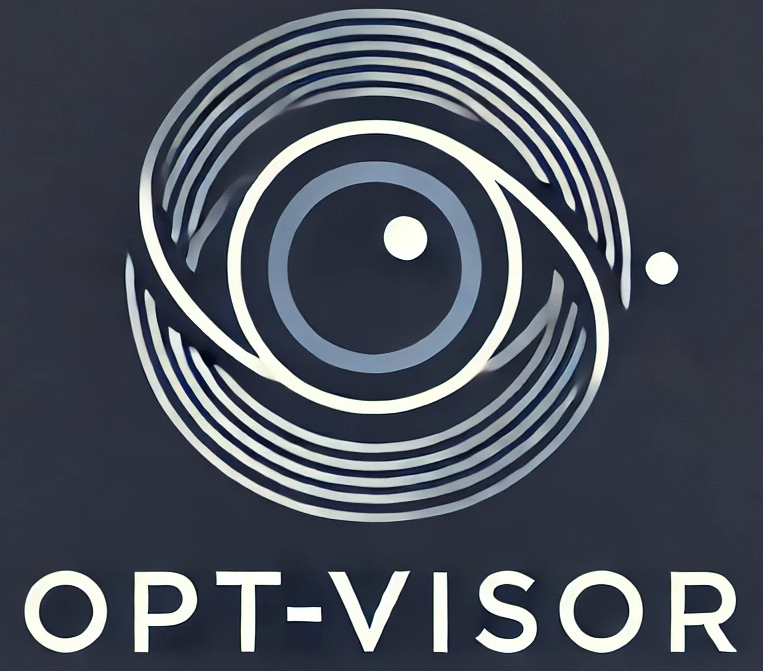
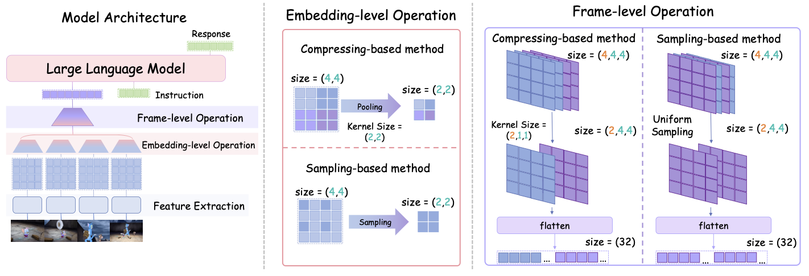

<h1>
  
  Exploring the Design Space of Visual Context Representation in Video MLLMs
</h1>

## 📰 News
[2024.10.12] Release the inference codes of Opt-Visor.

<p align="center">
    
</p>

## 🛠️ Requirements
- Python == 3.10.12

- CUDA Version == 12.4

```bash
pip install -r requirements.txt
```

## 🌍 Model Zoo

| Model Name     | Visual Encoder | Language Decoder | # Training Frames | Tokens per Frame |
|:----------------|:------------:|:----------------|:------------------|:----------------:|
| [Opt-Visor-120frame-49token-Qwen2-7B](https://huggingface.co/Richard1999/Opt-Visor-120frame-49token-Qwen2-7B)  | [siglip-so400m-patch14-384](https://huggingface.co/google/siglip-so400m-patch14-384) | [Qwen2-7B](https://huggingface.co/Qwen/Qwen2-7B)  | 120 | 49 |

## 🤖 Inference
Run the following command to get the response of an instruction:

```bash
python inference.py \
       --model_path /path/to/Opt-Visor \
       --gpu_id 0 \
       --video_path /path/to/your/video \
       --question "Please describe the video indetail."
```

## To Do List
- [x] Release the inference code.
- [ ] Release the model.

## 📑 Citation
```

```
